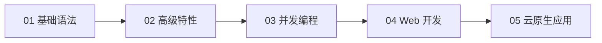

# Go-Cloud：Go 语言与云原生学习项目

> 基于 Go 语言，从基础语法到云原生应用开发的系统性学习项目。

---

## 学习路线



| 阶段 | 内容 | 对应目录 |
|------|------|----------|
| 01 基础语法 | 变量、控制流、函数、数组/切片、Map、结构体、方法、接口、错误处理 | `examples/01-basics/` |
| 02 高级特性 | 泛型、反射、unsafe、cgo、构建标签、函数式选项模式 | `examples/03-advanced/` |
| 03 并发编程 | goroutine、channel、select、sync 包、context、Worker Pool、Pipeline | `examples/02-concurrency/` |
| 04 Web 开发 | net/http、路由、中间件、RESTful API、参数校验、数据库操作 | `cmd/server/` `internal/` |
| 05 云原生应用 | gRPC、Docker、K8s、可观测性、CI/CD | `api/` `deployments/` |

---

## 快速开始

### 前置要求

- Go 1.22+
- Make（可选，Windows 可用 `make` 或直接使用 `go` 命令）

### 运行示例

```bash
# 基础语法
make example-basics
# 或
go run ./examples/01-basics

# 并发模式
make example-concurrency

# 高级特性
make example-advanced

# 运行所有示例
make examples
```

### 启动 Web 服务

```bash
make run-server
# 或
go run ./cmd/server
```

访问 `http://localhost:8080/health` 查看健康检查。

### 运行 CLI 工具

```bash
make run-cli ARGS="hello"
# 或
go run ./cmd/cli hello
```

---

## 项目结构

```
go-cloud/
├── cmd/                    # 应用程序入口
│   ├── server/main.go      # Web 服务
│   └── cli/main.go         # CLI 工具
├── internal/               # 私有业务逻辑
│   ├── handler/            # HTTP/gRPC Handler
│   ├── service/            # 业务逻辑 + 并发模式实践
│   ├── repository/         # 数据访问层
│   ├── model/              # 领域模型
│   └── util/               # 内部工具
├── pkg/                    # 可复用公共库
│   ├── logger/             # 日志封装
│   ├── config/             # 配置加载
│   └── errcode/            # 统一错误码
├── api/proto/              # Protobuf 定义
├── configs/                # 配置文件
├── deployments/            # Docker/K8s 部署清单
├── scripts/                # 构建、CI/CD、数据库迁移脚本
├── examples/               # 学习沙盒
│   ├── 01-basics/          # 基础语法
│   ├── 02-concurrency/     # 并发模式
│   └── 03-advanced/        # 高级特性
├── test/integration/       # 集成测试
├── Makefile                # 常用命令
└── Go-Learning.md          # 本文件
```

---

## 常用命令

| 命令 | 说明 |
|------|------|
| `make run-server` | 启动 Web 服务 |
| `make run-cli ARGS="hello"` | 运行 CLI |
| `make test` | 运行所有测试 |
| `make test-cover` | 测试覆盖率报告 |
| `make lint` | 代码静态检查 |
| `make build` | 编译二进制 |
| `make examples` | 运行所有学习示例 |

---

## 学习资源

- [Go 官方文档](https://go.dev/doc/)
- [Go by Example](https://gobyexample.com/)
- [Effective Go](https://go.dev/doc/effective_go)
- [Go 并发模式](https://go.dev/blog/pipelines)
- [Standard Go Project Layout](https://github.com/golang-standards/project-layout)

